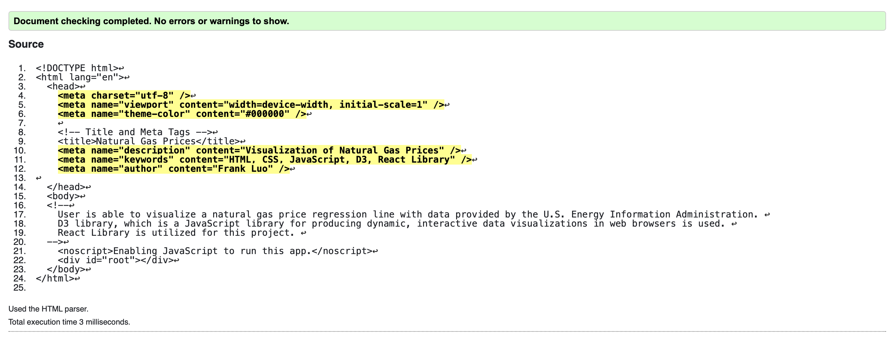
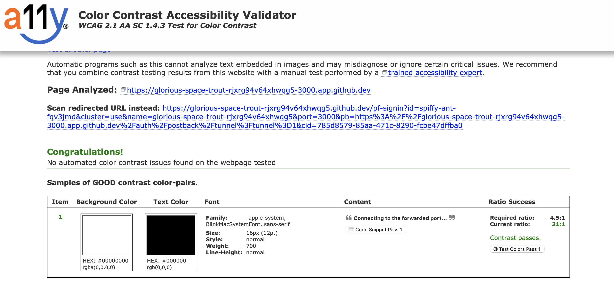
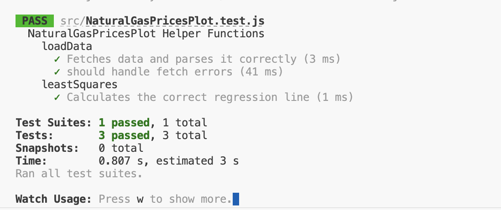
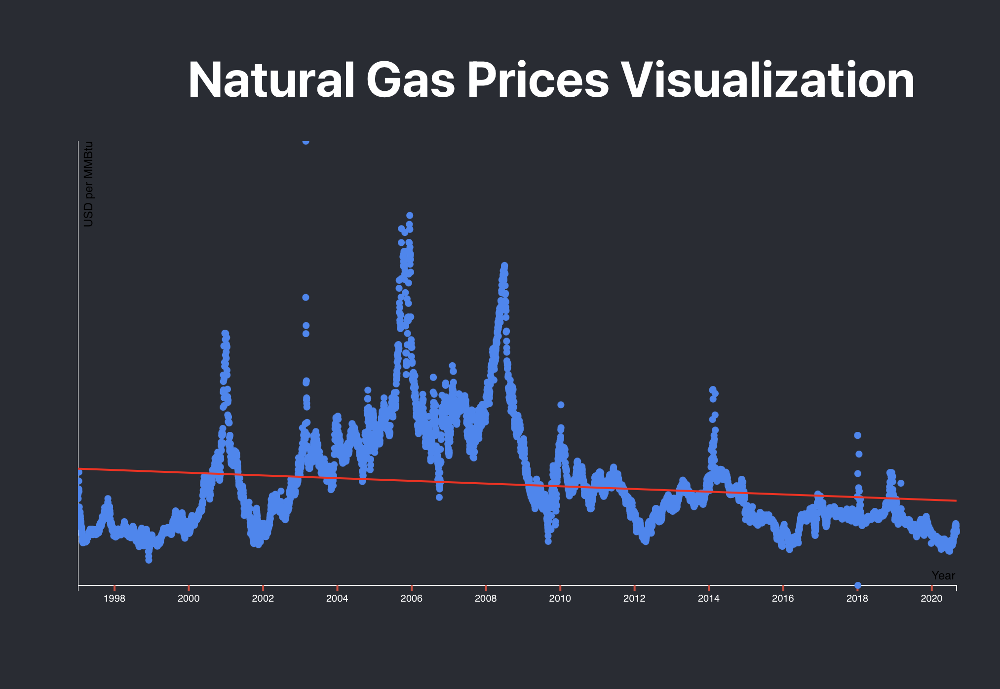

# Pick Your Own Data 👩🏽‍🔬🧑🏾‍💼📊📈✅

For this assignment you will:

* Practice using D3 with React.
* Apply your knowledge of fetching/reading real data.
* Finally, visualize somthing from your data (how/what is up to you).

## Data Requirements

The data you choose must:

* Be recently posted this year (past 365 days), although it can be data for last year that was just published this year. API requests for up-to-date data also allowed.
* Must have at least 100 records.
* Come from a reputable source.
* It cannot be the same as another student in this class.
* If it comes from Kaggle, or a similar source, then it cannot already have an associated D3 visualization.
* Heathrow and related Met Office weather data cannot be used.

Once you pick a data source, you will need to post on Piazza to:

1. Identify the data source
2. How you want to visualize your data
3. What story you expect your visual(s) to tell

The teaching team will verify these requirements and provide feedback on your proposed visuals. The data sets are on a first-come-first-serve basis.

## React

This project uses the React framework to add your D3 JSX code. You will **not** be allowed to use regular non-React D3. For examples of how to use D3 with React, visit [https://d3js.org/getting-started#d3-in-react](https://d3js.org/getting-started#d3-in-react) and [https://2019.wattenberger.com/blog/react-and-d3](https://2019.wattenberger.com/blog/react-and-d3) which provide detailed explainations.

## Testing

You will need to write regular unit tests as well as React components tests. Information on how to "render" a component and see the results can be found on [https://legacy.reactjs.org/docs/testing-recipes.html](https://legacy.reactjs.org/docs/testing-recipes.html) using Jest.

## Usual Requirements

The same requirements apply:

* Validated your html (at least what it generates) and have included metadata like in previous assignments.
* Test for contrast with a11y.
* Modified the documentation in the program's comments (for the files you edited) to describe the changes you made. Verify that you are well documenting your code using [JSDoc](https://www.npmjs.com/package/jsdoc) standards. You do not need to generate an API.
* Ensured that you write satisfactory unit tests and that your code passes them, with **75%** coverage, but the code you wrote needs to be completely covered.

Add screenshots to this section verifying these requirements.

## Reflection

* Include a screenshot of your generated visualization.

* Explain your visual(s), i.e. the story that is being described.

  The x axis represents the year while the y axis represents the price in USD per Million British Thermal Units (MMBtu). Despite short-term volatility and fluctuations, the regression line suggests that the long-term price of natural gas per MMBtu has remained relatively stable over the years. There is a recent downward trend in prices, possibly due to increased production from new sources of natural gas and technological advancements that make natural gas extraction more efficient. The graph shows volatility with certain periods of rapid price increases followed by sharp decreases. This could be resulted in certain times of the year where people need more heating as well as possible harsh economic times such as during a recession. Overall, the graph suggests a complex interplay of factors influencing natural gas prices over the last two-plus decades.

* Cite the source that you are using for your data.

    https://www.kaggle.com/datasets/joebeachcapital/natural-gas-prices which is taken from 
    the U.S. Energy Information Administration EIA.

* Cite any example source code that you used as part of creating your visual.

  I used the following sources to help create my visual: 

   https://react.dev/learn 

   https://kinsta.com/knowledgebase/what-is-react-js/

   https://www.youtube.com/watch?v=b9eMGE7QtTk

* Describe your experience testing React components.
  
  Testing was a bit confusing at first, but by reading the online resources provided in the ReadMe as well as watching some YouTube tutorial videos it became a lot more easy to understand how to do it.